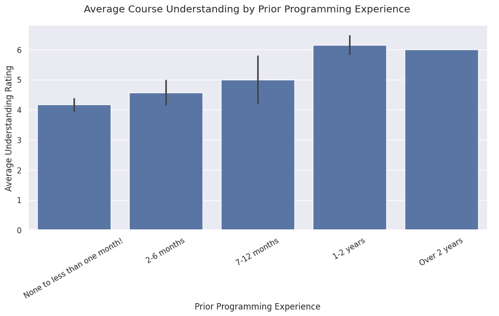
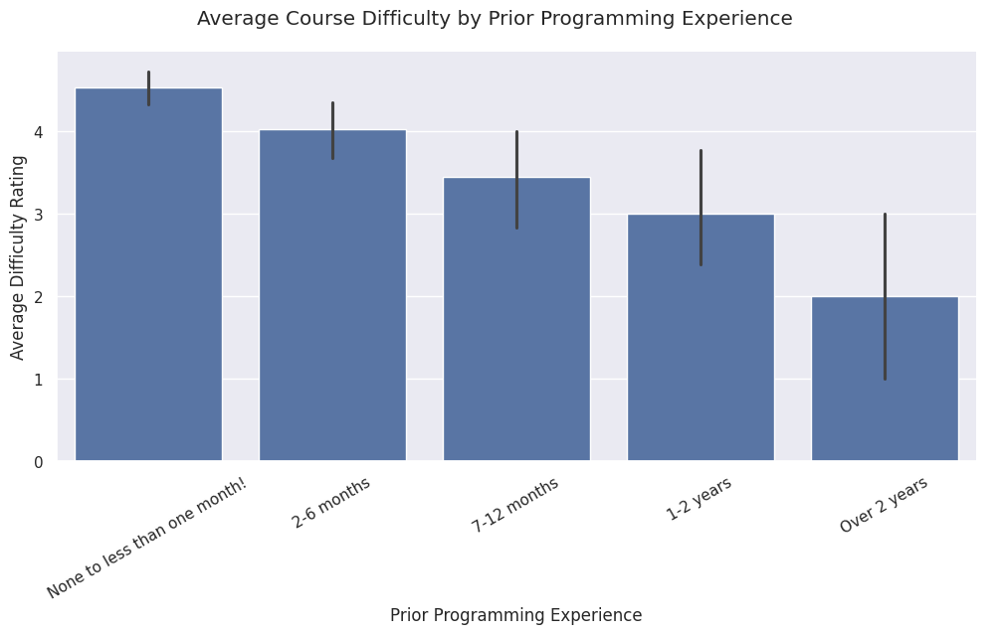
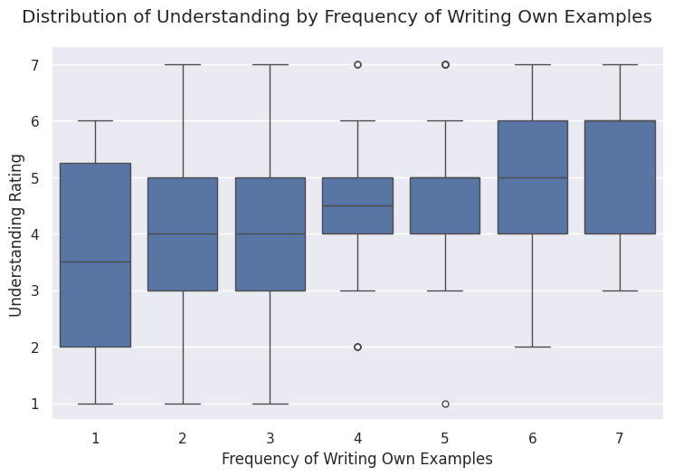

# COMP110 Data Analysis for Continuous Improvement

## Research Question

For this project, I analyzed how students’ prior programming experience and learning behaviors relate to their understanding of COMP110. Specifically, I looked at whether students with more prior programming experience reported higher understanding and lower difficulty, and whether students who more often write their own examples reported stronger understanding.

## Summary of Analysis

I used the anonymized COMP110 survey data from two CSV files and combined them into one dataset. I focused on the following variables:

- `prior_exp`: students’ prior programming experience
- `difficulty`: how difficult students found COMP110
- `understanding`: how well students felt they understood the course
- `own_examples`: how often students write their own examples when unsure

After loading and combining the data, I selected only the relevant columns, removed incomplete rows, converted numeric survey ratings from strings into integers, and compared average understanding and difficulty across different experience groups.

The analysis showed a clear pattern: students with more prior programming experience generally reported higher understanding and lower difficulty. Students with less than one month of prior programming experience had an average understanding rating of 4.17 and an average difficulty rating of 4.53. In comparison, students with 1–2 years of prior programming experience had an average understanding rating of 6.15 and an average difficulty rating of 3.00.

The analysis also suggested that students who more often write their own examples tend to report stronger understanding. This supports the idea that active learning behaviors may help students better understand course concepts.

## Visualization 1: Prior Experience and Understanding

This chart compares average understanding ratings across different prior programming experience groups. Students with more prior programming experience generally reported higher understanding.

## Visualization 2: Prior Experience and Difficulty

This chart compares average difficulty ratings across different prior programming experience groups. Students with less experience generally reported higher difficulty, while students with more experience reported lower difficulty.

## Visualization 3: Writing Own Examples and Understanding

This chart shows the distribution of understanding ratings based on how often students write their own examples. Students who more frequently write their own examples generally appear to have higher understanding ratings.

## Conclusion

Overall, my analysis supports the idea that prior programming experience and active learning behaviors are related to students’ understanding of COMP110. Students with less than one month of prior programming experience had an average understanding rating of 4.17 and an average difficulty rating of 4.53. In comparison, students with 1–2 years of prior experience had an average understanding rating of 6.15 and an average difficulty rating of 3.00. This suggests that students with more programming background generally feel more confident and find the course less difficult, while students with little prior experience may need more structured support.

The analysis also suggests that writing one’s own examples is connected to stronger understanding. Students who rated themselves lower on writing their own examples tended to have lower average understanding, while students with higher ratings for this behavior generally reported higher understanding. The box plot supports this pattern by showing that students who more frequently create their own examples tend to have higher median understanding ratings. This does not prove that writing examples directly causes better understanding, but it does suggest that active learning habits may be useful to encourage in the course.

Based on these findings, my recommendation is that COMP110 should add more structured beginner support that encourages active learning, especially for students with little or no prior programming experience. This could include short optional practice sets, guided “make your own example” prompts, or short walkthroughs that show how to move from a concept to a working example.

There are some limitations and trade-offs to this recommendation. One limitation is that some experience groups were much smaller than others. For example, the “Over 2 years” group only had 3 students, so its average ratings are less reliable than the larger groups. Another limitation is that the data is based on self-reported survey responses, so students may interpret ratings differently. A potential cost is that adding more beginner resources could increase workload for instructional staff, especially if they need to create videos, examples, or extra practice problems. There is also a risk that too many extra resources could overwhelm students or make the course feel more time-consuming.

A future refinement would be to test which type of beginner support is most effective. For example, the course could compare optional debugging videos, guided example-writing exercises, and extra practice problems to see which one improves understanding the most. Future surveys could also ask students directly whether they used these resources and whether they helped. This would make the analysis stronger because it would connect specific course interventions to student outcomes rather than only comparing existing behaviors and experience levels